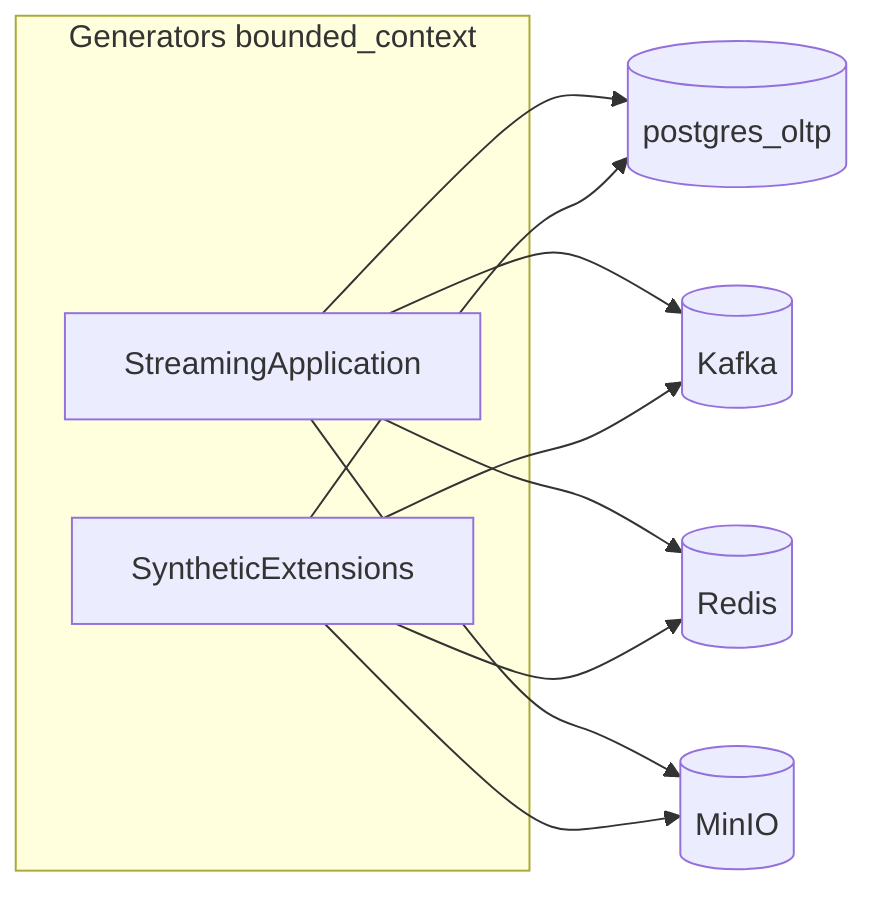

# Генераторы синтетических данных (TechMart)

**Bounded context генератора** отвечает только за **эмиссию синтетических данных** в **четыре назначения**: PostgreSQL **OLTP**, **Kafka**, **Redis**, **MinIO**. Внутренние преобразования при генерации (агрегации, распределения, сборка payload) входят в этот контур.

**Вне контура** остаётся ETL/ELT: Airflow, Spark, dbt и загрузка в DWH/OLAP (`postgres_olap`). Генератор **не** пишет в OLAP и не управляет dbt; витрины и канон DV: [diagrams/dwh-schemas.md](diagrams/dwh-schemas.md), [diagrams/data_vault_flow.md](diagrams/data_vault_flow.md), [PIPELINES.md](PIPELINES.md), [DV2_ENTITY_KEYS.md](DV2_ENTITY_KEYS.md).

## Схема потоков

Источник истины по транзакционным сущностям для демо — **OLTP**. Kafka и MinIO несут события и файловые артефакты для ingestion downstream.

## Конфигурация: JSON, XML, переменные окружения

| Слой | Файл / механизм | Содержание |
|------|-----------------|------------|
| Профиль «компания» | [configs/generators/company.generator.json](../configs/generators/company.generator.json) | Режим тиков, сиды, объёмы per tick, включатели sink’ов, имена топиков/каналов/prefixes (**без секретов**) |
| Сценарные распределения | [configs/generators/*.xml](../configs/generators/) | Веса, XML-лимиты для расширений (маркетинг, SEO, HR и т.д.), монтируется в контейнер как `/app/configs/generators` |
| Секреты и DSN | `.env` / compose | `OLTP_DSN`, `KAFKA_*`, `REDIS_URL`, ключи MinIO |
| Одноразовый overlay без файла | `GENERATOR_SETTINGS_JSON` | Одна строка JSON-объекта; поверх содержимого, загруженного из `GENERATOR_SETTINGS_FILE` / `company.generator.json` |

**Порядок склейки профиля (до чтения per-field env в `load_config`):** базовые дефолты в коде (`_baseline`) меньше **файлового JSON** (`GENERATOR_SETTINGS_FILE`, иначе `GENERATOR_CONFIG_DIR/company.generator.json`) меньше **`GENERATOR_SETTINGS_JSON`** меньше **meta-store** (`generator.config_overrides` при включённом store).

**Пофилдовый приоритет в рантайме:** для каждого поля `Config` **непустая переменная окружения перекрывает merged-профиль** ([generators/common/config.py](../generators/common/config.py)). Пустая строка в env не перекрывает (остаётся merged).

**Docker Compose:** переменные с хоста попадают в контейнер `data_generator` только если они **перечислены** в `environment` сервиса (или через `env_file`). Ключи из корневого `.env`, используемые только как `${VAR}` в compose, сами по себе **не пробрасываются** — для override без правки JSON добавьте нужные переменные в блок `environment` образца [docker-compose.yml](../docker-compose.yml) или используйте смонтированный `company.generator.json`.

**Опциональный meta-store:** при `GENERATOR_USE_META_STORE=true` и непустом `GENERATOR_META_DSN` после JSON подмешивается объект из столбца `settings` таблицы `generator.config_overrides` (профиль `GENERATOR_PROFILE`, по умолчанию `default`). Если флаг включён, а `GENERATOR_META_DSN` пустой, выполняется только предупреждение в логе; работа продолжается от JSON/meta без БД. Схема: [services/postgres/init/06_generator_meta.sql](../services/postgres/init/06_generator_meta.sql) на базе `postgres_metadb`.

Перечень ключей merged-профиля и имён переменных — в [generators/common/config.py](../generators/common/config.py).

## Структура пакета (слои)

| Слой | Назначение | Пути |
|------|------------|------|
| `domain` | Константы и чистая логика без I/O | `generators/domain/` |
| `application` | Оркестрация тика, `StreamingGenerator`, расширения по поддоменам (mixins) | `generators/application/` |
| `infrastructure` | Коннекторы, загрузка XML/JSON-профиля | `generators/infrastructure/` |
| `interfaces` | Точка входа CLI | `generators/interfaces/cli.py`, корневой [generators/generator.py](../generators/generator.py) |

Расширенные сценарии собраны в [generators/application/extensions/](../generators/application/extensions/) (маркетинг, SEO, HR, телеметрия, finance). [generators/extra/runner.py](../generators/extra/runner.py) — тонкий реэкспорт для обратной совместимости.

## Код и DDL: откуда читать

| Путь | Содержание |
|------|------------|
| [generators/generator.py](../generators/generator.py) | Вход: `main()` |
| [generators/application/streaming_generator.py](../generators/application/streaming_generator.py) | Цикл `StreamingGenerator` |
| [generators/common/config.py](../generators/common/config.py) | `load_config()`, merge JSON / meta / env |
| [generators/infrastructure/settings/company_profile.py](../generators/infrastructure/settings/company_profile.py) | Загрузка JSON и meta-store |
| [generators/common/connectors/](../generators/common/connectors/) | Реэкспорт коннекторов (реализация в `infrastructure/connectors/`) |
| [services/postgres/init/02_oltp_schema.sql](../services/postgres/init/02_oltp_schema.sql) | OLTP DDL |
| [services/postgres/init/02b_oltp_marketing_hr_finance.sql](../services/postgres/init/02b_oltp_marketing_hr_finance.sql) | Расширения OLTP |

## Соответствие диаграммам

| Система | Документация |
|---------|--------------|
| OLTP | [diagrams/oltp-er.md](diagrams/oltp-er.md) |
| Kafka | [diagrams/kafka-er.md](diagrams/kafka-er.md) — имена топиков по умолчанию согласованы с `company.generator.json` |
| MinIO | [diagrams/minio-er.md](diagrams/minio-er.md) — префиксы согласованы с `company.generator.json` |
| DWH (вне генератора) | [diagrams/dwh-schemas.md](diagrams/dwh-schemas.md) |

## Запуск в Docker Compose

Сервис **`data_generator`** в профиле `generators`: к образу монтируется только `./configs/generators`. Пример: `docker compose --profile generators up -d data_generator`. Профиль компании задаётся файлом `GENERATOR_SETTINGS_FILE` (по умолчанию путь к `company.generator.json` внутри mount). В `docker-compose.yml` явно проброшен набор переменных (`${VAR:-}`), чтобы ключи из `.env` могли переопределить профиль без правки только JSON. Код генератора берётся из образа; для live-разработки можно добавить bind-mount `./generators:/app` в локальном override.

**Если контейнер «unhealthy»:** healthcheck проверяет наличие `/tmp/generator.alive`, который записывается в `StreamingGenerator.run()` после успешной инициализации коннекторов и сидирования. Если падение произошло **до** первого heartbeat (например, при `seed_reference`), файл не создаётся и контейнер остаётся unhealthy до правки конфигурации или перезапуска.

## Каналы данных (смысл)

### OLTP

Справочники, заказы, расширения (кампании, SEO-ключи, сотрудники, feature flags, GL) — см. SQL-инициализацию.

### Kafka

События заказов, платежей, кликстрима, доставок и потоков расширений.

### MinIO

Сырьевые файлы (каталог, возвраты, платежи — по сценарию) и parquet/csv/jsonl из расширений.

### Redis

Pub/stream и при расширениях — hash с агрегатами web vitals.

## Проверка

1. Только Kafka: в JSON или env отключить `enable_oltp` / `enable_minio` и проверить рост offset.
2. E2E: см. [PIPELINES.md](PIPELINES.md) — цепочка ingestion → DWH выполняется **вне** генератора.

## Тесты

- **Юнит:** `pytest tests/unit` — конфигурация (`load_config`, merge JSON), `company_profile`, доменные хелперы, разбор XML без сетевых вызовов. См. [SETUP.md](SETUP.md).
- **Интеграция (опционально):** `pytest tests/integration -m integration` при заданных `GENERATOR_IT_*` (см. [SETUP.md](SETUP.md)); без стека тесты помечаются `skip`.

## Roadmap (вне текущего обязательного scope)

Идеи для будущих итераций (документирование демо CV/analytics):

1. **Синтетическая «транскрипция» звонков** — шаблонные тексты, метаданные и складывание в MinIO и/или Kafka для NLP-пайплайнов.
2. **Синтетические PDF платёжек / квитанций** — бинарные объекты в MinIO (и при необходимости ссылки в OLTP/Kafka) для офисных/analyst сценариев.

Ограничения: генератор по-прежнему не пишет в `postgres_olap`; связка с dbt/Airflow остаётся в контуре оркестрации, не в коде генератора.

---

*DDL таблиц не дублируются здесь целиком — см. SQL в репозитории и Mermaid в [diagrams/](diagrams/README.md).*
