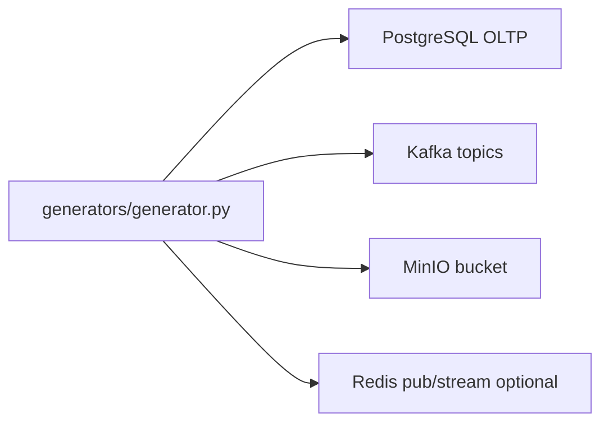

# Генераторы синтетических данных (TechMart)

Документ описывает **что** генерирует стенд, **куда** пишет и **как** с этим согласованы диаграммы. Полные **DDL** таблиц **не** дублируются: они в SQL-инициализации Postgres и в Mermaid-файлах (см. [diagrams/](diagrams/README.md)).

## Зачем это нужно

Без «живых» данных не проверить ingestion, Spark, dbt, мониторинг. Генераторы создают **согласованный сюжет** маркетплейса: пользователи, продавцы, товары, заказы, платежи, кликстрим, доставки, часть файлов в MinIO.

## Обзор потока

Тот же смысл текстом:

- **OLTP** — нормализованные заказы, позиции, сущности-справочники.
- **Kafka** — потоки событий (заказы, оплаты, кликстрим, доставки).
- **MinIO** — «сырые» файлы (каталог, возвраты, вложения к платежам — по сценарию).
- **Redis** (если включён) — публикация/стримы для сценариев с pub/sub (см. конфиг).

## Код: откуда читать

| Путь | Содержание |
|------|------------|
| [generators/generator.py](../generators/generator.py) | Основной цикл `StreamingGenerator`, tick, остановка |
| [generators/common/config.py](../generators/common/config.py) | Переменные окружения, значения по умолчанию |
| [generators/common/connectors/oltp.py](../generators/common/connectors/oltp.py) | Запись в OLTP |
| [generators/common/connectors/kafka_producer.py](../generators/common/connectors/kafka_producer.py) | Публикация в Kafka |
| [generators/common/connectors/minio_uploader.py](../generators/common/connectors/minio_uploader.py) | Загрузка объектов |
| [generators/kafka/*.py](../generators/kafka/) | Отдельные сценарии/генераторы по каналам (при необходимости) |
| [services/postgres/init/02_oltp_schema.sql](../services/postgres/init/02_oltp_schema.sql) | Фактическая схема OLTP (источник правды по DDL) |

## Переменные окружения (основные)

Список и дефолты — в [generators/common/config.py](../generators/common/config.py). Типовые:

| Группа | Примеры переменных | Смысл |
|--------|-------------------|--------|
| Режим | `GENERATOR_MODE`, `GENERATOR_TICK_SECONDS` | Скорость тиков, режим `streaming` |
| Объёмы | `GENERATOR_SEED_*`, `GENERATOR_ORDERS_PER_TICK_*`, `GENERATOR_CLICKS_PER_TICK_*` | Сколько сущностей в справочнике и в одном тике |
| Включатели | `GENERATOR_ENABLE_OLTP`, `GENERATOR_ENABLE_KAFKA`, `GENERATOR_ENABLE_MINIO`, `GENERATOR_ENABLE_REDIS` | Куда писать |
| Kafka | `KAFKA_BOOTSTRAP_SERVERS`, `KAFKA_TOPIC_CLICKSTREAM`, `KAFKA_TOPIC_ORDERS`, `KAFKA_TOPIC_PAYMENTS`, `KAFKA_TOPIC_SHIPMENTS` | Брокер и имена топиков |
| MinIO | `MINIO_*` | Эндпоинт, ключи, bucket, префиксы |
| OLTP | `OLTP_DSN` | Строка подключения к `postgres_oltp` |

Точные имена переменных в вашем стенде — в `.env.example`.

## Соответствие диаграммам

| Система | Документация в репо |
|---------|-------------------|
| DWH (схемы dbt, meta) | [diagrams/dwh-schemas.md](diagrams/dwh-schemas.md) |
| OLTP (ER) | [diagrams/oltp-er.md](diagrams/oltp-er.md) |
| Kafka (топики/события) | [diagrams/kafka-er.md](diagrams/kafka-er.md) |
| MinIO (префиксы/объекты) | [diagrams/minio-er.md](diagrams/minio-er.md) |

Имена топиков и бакетов в диаграммах должны **совпадать** с `Config` в `common/config.py` и с `.env`, иначе ingestion «не увидит» данные.

## Какие данные по каналам (смысл)

### OLTP (PostgreSQL)

- Справочники: пользователи, продавцы, товары, категории.
- Транзакции: заказы, строки заказа, оплаты (по сценарию).
- **Проверка:** сравнить схему с [02_oltp_schema.sql](../services/postgres/init/02_oltp_schema.sql) и ER-диаграммой.

### Kafka

- **Заказы** — события оформления/изменения.
- **Платежи** — движения по оплатам.
- **Кликстрим** — просмотры, воронка, трафик.
- **Доставки** — статусы/трек (по настройке).

**Проверка:** `kafka-console-consumer` или UI брокера; имена топиков — в конфиге и [kafka-er.md](diagrams/kafka-er.md).

### MinIO (S3 API)

- Пакетные/файловые **сырьевые** зоны: выгрузки, каталог, возвраты.
- **Проверка:** список объектов в bucket, путь = префикс из конфига; см. [minio-er.md](diagrams/minio-er.md).

## Примеры сценариев проверки

1. **Только Kafka:** отключить OLTP/Minio в `GENERATOR_ENABLE_*`, убедиться, что в топиках растёт offset, затем смотреть Airflow raw-ingestion.
2. **E2E:** оставить все каналы, пройти [PIPELINES.md](PIPELINES.md) до marts, сверить фактическое число строк в витрине с ожидаемым порядком величин.
3. **Свежесть:** уменьшить `GENERATOR_TICK_SECONDS` для нагрузочного сценария (осторожно в слабой среде).

## Связь с dbt / Data Vault

Генераторы питают **нижние** слои; дальше данные идут по [diagrams/data_vault_flow.md](diagrams/data_vault_flow.md) и [PIPELINES.md](PIPELINES.md). Для бизнес-логики сценариев — [business/use_cases.md](business/use_cases.md).

---

*Старые версии документа с десятками страниц DDL заменены на ссылки к фактическим схемам: так проще не разъехаться с миграциями в Git.*
