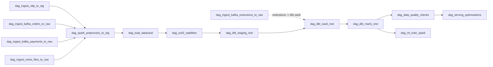

# Airflow: DAG и цепочка данных

В проекте **14** Airflow DAG, связанных через **Datasets** (события вместо жёсткого `ExternalTaskSensor` там, где настроено). Цепочка: ingestion, Spark-препроцессинг, загрузка **Data Vault**, SCD2, слои **dbt** (через dbt REST), data quality, serving и обучение в Spark с **MLflow**.

Сводка стека и бизнес-образ: [PROJECT_SUMMARY.md](PROJECT_SUMMARY.md). Схема dbt: [diagrams/data_vault_flow.md](diagrams/data_vault_flow.md).

Корень ingress (`/` на порту `INGRESS_PORT`, по умолчанию 8090) — **Flask-портал** (`portal_web`): обзор маршрутов, C4-подобная диаграмма и индикаторы состояния контейнеров (Docker + health + HTTP probe). JSON: `GET /api/status` (в nginx вынесен exact-location, чтобы не пересекаться с `/api/` dbt-web backend). UI dbt-web открывается по **`/dbt/`** (`/dbt-web/` редиректит сюда). В портале блок «API и внутренняя сеть» перечисляет в том числе **REST за ingress** (`/schema-registry/`, `/kafka-connect/` — только JSON, при CDC-overlay) и внутренние хосты без префикса; см. [WEB_UI_ACCESS.md](WEB_UI_ACCESS.md) и [API.md](API.md).

## Архитектура верхнего уровня

Таблица **`raw.kafka_extension_events`** пополняется **`dag_ingest_kafka_extensions_to_raw`**; dbt-модели (`stg_extension_kafka_events`, hubs/satellites vault) опираются на raw. **`dag_dbt_vault_rest`** подписан на **`DS_DBT_STAGING_DONE | DS_RAW_KAFKA_EXTENSIONS`**: полная цепочка идёт через Spark, Python Vault и SCD2; при появлении только extensions запускается **dbt vault** без лишнего Python `dag_load_datavault`. **`dag_spark_preprocess_to_stg`** использует **логическое ИЛИ** по четырём raw-dataset’ам (OLTP, Kafka orders/payments, MinIO), чтобы не ждать неактивный источник при холодном старте.

## Каталог DAG

| # | DAG | Слой | Источник | Расписание | Outlet | Примечание |
|---|---|---|---|---|---|---|
| 1 | `dag_ingest_oltp_to_stg` | ingestion | OLTP Postgres | `*/15 * * * *` | `raw_oltp` | Watermark по таблицам |
| 2 | `dag_ingest_kafka_orders_to_raw` | ingestion | Kafka `orders` | `*/5 * * * *` | `raw_kafka_orders` | Micro-batch + offsets |
| 3 | `dag_ingest_kafka_payments_to_raw` | ingestion | Kafka `payments` | `*/5 * * * *` | `raw_kafka_payments` | Аналогично orders |
| 4 | `dag_ingest_minio_files_to_raw` | ingestion | MinIO objects | `*/15 * * * *` | `raw_minio_files` | Manifest + quarantine |
| 5 | `dag_ingest_kafka_extensions_to_raw` | ingestion | Kafka marketing/SEO/HR/features | `*/5 * * * *` | `raw_kafka_extensions` | В `raw.kafka_extension_events` |
| 6 | `dag_spark_preprocess_to_stg` | preprocessing | raw -> stg | **ИЛИ** по OLTP, kafka orders/payments, MinIO | `stg_clean` | Любой из четырёх raw-datasets запускает job; см. код. |
| 7 | `dag_load_datavault` | vault | stg -> hubs/links | `stg_clean` | `vault_loaded` | SHA-256 hash keys + idempotent upsert (customers/orders + link) |
| 8 | `dag_scd2_satellites` | vault | hubs -> sats | `vault_loaded` | `vault_scd2_done` | Python SCD2 + late arriving |
| 9 | `dag_dbt_staging_rest` | dbt | dbt run | `vault_scd2_done` | `dbt_staging_done` | REST trigger/polling |
| 10 | `dag_dbt_vault_rest` | dbt | dbt run | **ИЛИ** `dbt_staging_done` или `raw_kafka_extensions` | `dbt_vault_done` | Extensions: dbt vault без Python load_datavault |
| 11 | `dag_dbt_marts_rest` | dbt | dbt run | `dbt_vault_done` | `dbt_marts_done` | `tag:marts` |
| 12 | `dag_data_quality_checks` | quality | DQ | dataset-driven | `dq_passed` | Инварианты + severity |
| 13 | `dag_serving_optimizations` | serving | marts | dataset-driven | `serving_optimized` | Index/VACUUM/REINDEX |
| 14 | `dag_ml_train_spark` | mlops | Spark + MLflow | dataset-driven | `ml_train_done` | Обучение + registry |

## Watermarks и идемпотентность

- Watermarks ingestion DAG хранятся в `meta.pipeline_watermarks` (`pipeline_name`).
- OLTP: timestamp watermark по каждой таблице.
- Kafka: offsets по партициям в JSON, commit только после успешной вставки.
- MinIO: file manifest со статусами `discovered|loaded|quarantined`.
- DV/SCD2: hash-key upsert через `ON CONFLICT`, повторный запуск безопасен.

## Наблюдаемость

- `meta.pipeline_runs` заполняется через `start_run` / `finish_run`.
- `meta.dq_results` хранит результаты DQ-проверок.
- Представления: `meta.v_pipeline_runs_recent`, `meta.v_pipeline_runs_summary`, `meta.v_dq_recent`.
- Логи: структурированный JSON (`services/common/logging_utils.JsonFormatter`).
- Отдельный контур DQC и чек-листы: [QUALITY_AND_MONITORING.md](QUALITY_AND_MONITORING.md); тесты dbt и запуск см. [TESTING_AND_DATA_QUALITY.md](TESTING_AND_DATA_QUALITY.md); Grafana и метаданные — [OBSERVABILITY_AND_LOGGING.md](OBSERVABILITY_AND_LOGGING.md).

## Надёжность

- Ретраи по умолчанию: 3 + exponential backoff (5 -> 30 мин), см. `pipelines/utils/dag_factory.py`.
- Для dbt REST задан отдельный retry policy в `configs/pipeline/dbt_rest.yaml`.
- DQ DAG блокирует serving при `severity in (critical, error)`.

## Конфигурация

Основные конфиги расположены в `configs/pipeline/`:

- `dag_registry.yaml`
- `ingestion.yaml`
- `datavault.yaml`
- `dbt_rest.yaml`
- `schemas.yaml`
- `watermarks.yaml`
- `dq_checks.yaml`
- `serving.yaml`

В Airflow они доступны по пути `/opt/airflow/configs/pipeline` через `DATAOPS_CONFIG_DIR`.

## Критерии приёмки

- Все 14 DAG парсятся без import errors.
- Dataset-зависимости корректно отображаются в Airflow UI.
- Повторные ingestion-run не создают дублей в `raw.*`.
- `dag_load_datavault` и `dag_scd2_satellites` идемпотентны.
- `dag_data_quality_checks` блокирует serving при нарушениях.
- Каждая задача пишет результат в `meta.pipeline_runs`.
- Секреты читаются из env/connections, не захардкожены в коде.
