# C4 (уровень контейнеров): DataOpsShowcase

**Назначение:** единая карта **runtime** в Docker Compose — кто с кем говорит по HTTP/данным. Это **не** замена ER по Kafka/MinIO/OLTP: те схемы описывают **данные**, здесь — **платформа**.

**Правда по именам:** [`docker-compose.yml`](../../docker-compose.yml), сеть `dataops_net`. Маршруты с хоста: [`WEB_UI_ACCESS.md`](../WEB_UI_ACCESS.md), внутренние URL: [`API.md`](../API.md). Упрощённый граф для портала: [`services/portal_web/data/catalog.json`](../../services/portal_web/data/catalog.json).

**Вне диаграммы:** одноразовые job `airflow_init`, `superset_init` — только bootstrap.

## Диаграмма (Mermaid)

```mermaid
flowchart TB
  Dev([Пользователь с хоста])

  subgraph IngressLayer [Вход]
    ING[dataops_ingress]
  end

  subgraph WebLayer [За ingress: веб и JSON]
    PORT[portal_web]
    AFWEB[airflow_webserver]
    MLF[mlflow]
    GRAF[grafana]
    SUP[superset]
    JUP[jupyterhub]
    NRD[node_red]
    PRUI[prometheus]
    PGWUI[pushgateway]
    SM[spark_master]
    SW[spark_worker]
  end

  subgraph OrcLayer [Airflow исполнение]
    AFS[airflow_scheduler]
    AFT[airflow_triggerer]
  end

  subgraph ProcLayer [Трансформации и dbt API]
    DBTREST[dbt-rest]
    DBTCLI[dbt]
  end

  subgraph DataLayer [Данные и объектное хранилище]
    PGOLTP[(postgres_oltp)]
    PGOLAP[(postgres_olap)]
    PGMETA[(postgres_metadb)]
    KFK[kafka]
    SR[schema_registry]
    CONN[debezium_connect]
    ATLAS[atlas_server]
    RDS[redis]
    MINIO["minio: S3 + UI console"]
  end

  Dev --> ING
  ING --> PORT
  ING --> AFWEB
  ING --> MLF
  ING --> GRAF
  ING --> SUP
  ING --> JUP
  ING --> NRD
  ING --> PRUI
  ING --> PGWUI
  ING --> MINIO
  ING --> SM
  ING --> SW
  ING -.->|/atlas/| ATLAS
  ING -.->|REST| SR
  ING -.->|REST| CONN

  AFWEB --> AFS
  AFWEB --> AFT
  AFWEB --> DBTREST
  AFWEB --> SM
  AFWEB --> KFK
  AFWEB --> PGOLTP
  AFWEB --> PGOLAP
  AFWEB --> MINIO

  ING -.->|статика dbt/target| DBTCLI

  DBTCLI --> PGOLAP
  DBTCLI --> MINIO

  SM --> SW

  SUP --> PGOLAP
  MLF --> PGMETA
  MLF --> MINIO
  GRAF --> PRUI
  PGWUI -.->|push метрик| PRUI

  PORT -.->|read-only docker.sock| DOCKER_HOST[Docker Engine]

  SR -.-> KFK
  CONN -.-> KFK
  CONN -.-> SR

  subgraph OptProfile [Опционально profile generators]
    GEN[data_generator]
  end

  GEN -.-> PGOLTP
  GEN -.-> KFK
  GEN -.-> MINIO
  GEN -.-> RDS
```

## Заметки по связям

- **minio** — и **S3 API** (`:9000` в сети), и бэкенд **консоли** за ingress (`/minio-console/`). С хоста к API часто `localhost:${MINIO_PORT}`.
- **dbt-rest** не публикует порт на хост: только `dbt-rest:8580` внутри compose. Вызовы — из Airflow и внешних клиентов в сети. **dbt Docs** за ingress — только чтение смонтированного **`dbt/target/`** (тот же каталог, что использует CLI-контейнер `dbt` и **dbt-rest** при прогонах).
- **CDC / Atlas:** в корневом compose; маршруты `/schema-registry/`, `/kafka-connect/`, `/atlas/` — см. [`ARCHITECTURE_CDC.md`](../ARCHITECTURE_CDC.md), [`ARCHITECTURE_ATLAS.md`](../ARCHITECTURE_ATLAS.md).
- **Node-RED:** за ingress `/node-red/`; учётные данные в `.env` (`NODE_RED_ADMIN_*`).

## См. также

- [README.md](README.md) — индекс всех диаграмм
- [data_vault_flow.md](data_vault_flow.md) — поток данных по слоям dbt (логический)
- [dwh-schemas.md](dwh-schemas.md) — схемы PostgreSQL OLAP
- [../ARCHITECTURE.md](../ARCHITECTURE.md) — монорепо
