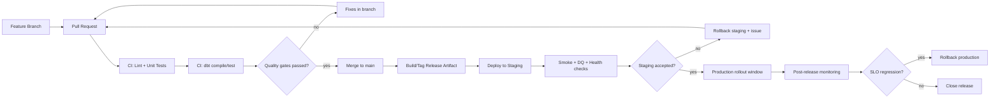

# CI/CD + release governance flow

Диаграмма описывает целевой release-поток для data-platform изменений: код -> quality gates -> controlled rollout -> rollback при необходимости.

## Диаграмма (Mermaid)

## Практический смысл

- Делает quality gates обязательной частью релиза, а не ручной опцией.
- Увязывает rollout с наблюдаемостью и SLO, чтобы быстро фиксировать регрессы.
- Явно описывает rollback как нормальный путь управления риском.

## См. также

- [../SETUP.md](../SETUP.md)
- [../TESTING_AND_DATA_QUALITY.md](../TESTING_AND_DATA_QUALITY.md)
- [../QUALITY_AND_MONITORING.md](../QUALITY_AND_MONITORING.md)
- [../GAPS_AND_PRODUCTION_READINESS.md](../GAPS_AND_PRODUCTION_READINESS.md)
