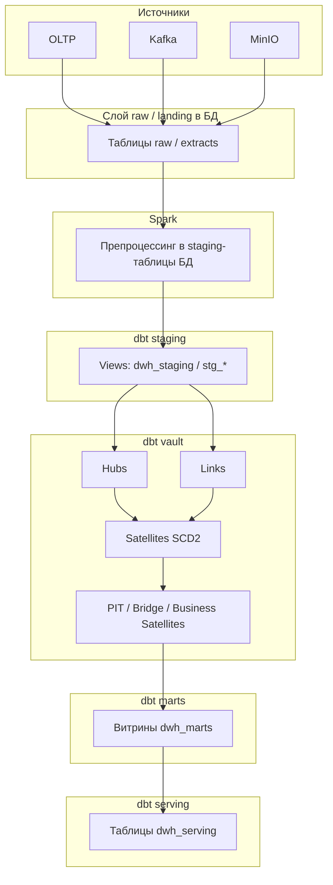

# Поток данных: от сырья к витринам (dbt / Data Vault)

## Границы

Описание **слоя данных и dbt** (без контейнеров и ingress). Платформа в Docker: [c4-container.md](c4-container.md).

Схема отражает **логические слои** проекта [dbt/dbt_project.yml](../../dbt/dbt_project.yml): `staging` (views) → **raw Data Vault** (hubs, links, satellites) → **business Data Vault** (PIT, bridge, business satellites) → **marts** → **serving**.

**Имена схем в PostgreSQL (DWH):** [dwh-schemas.md](dwh-schemas.md). Реальная оркестрация (Airflow DAG, SCD2, порядок job) — [../PIPELINES.md](../PIPELINES.md).

## Схема (Mermaid)

## Кратко по слоям

| Слой | Схемы (из `dbt_project`) | Назначение |
|------|--------------------------|------------|
| Staging | `dwh_staging`, views | Нормализация имён, типов, единый `record_source` |
| Vault raw | `dwh_vault` (hubs, links, satellites) | **Raw Data Vault**: бизнес-ключи, связи, история в саттелитах |
| Vault business | `dwh_bdv` (pit, bridge, business_satellites) | **Business DV**: срезы во времени, мосты, PIT |
| Marts | `dwh_marts` | Витрины для BI и downstream |
| Serving | `dwh_serving` | Узкие таблицы «под продукт»/экспорт |

## Ключи расширений (Generators / OLTP)

- [../DV2_ENTITY_KEYS.md](../DV2_ENTITY_KEYS.md) — канон бизнес-ключей для маркетинга, SEO, HR, GL и Kafka extension-событий.

## См. также

- [c4-container.md](c4-container.md) — контейнеры и ingress (runtime)
- [../SUPERSET.md](../SUPERSET.md) — дашборды по витринам `dwh_marts`
- [oltp-er.md](oltp-er.md), [kafka-er.md](kafka-er.md), [minio-er.md](minio-er.md) — что приходит **до** dbt
- [../ARCHITECTURE.md](../ARCHITECTURE.md) — монорепо
- [../Generators.md](../Generators.md) — генераторы TechMart
