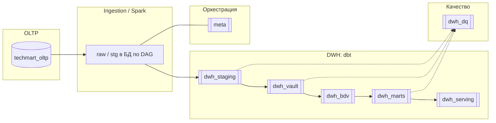

# Аналитическое хранилище (DWH): схемы PostgreSQL

**Назначение:** показать, **в каких схемах** лежат слои витрины и метаданных в текущем репозитории. Согласовано с [dbt/dbt_project.yml](../../dbt/dbt_project.yml) и init SQL: [services/postgres/init/04_dwh_extensions.sql](../../services/postgres/init/04_dwh_extensions.sql), [dbt/macros/utils/ensure_dwh_schemas.sql](../../dbt/macros/utils/ensure_dwh_schemas.sql).

**Важно:** OLTP (операционные заказы) — **отдельная** база/контейнер (`postgres_oltp`, схема с транзакциями). Ниже — **аналитический** Postgres, куда dbt пишет модели и куда Airflow/Spark пишут raw/staging по пайплайнам (подробнее — [../PIPELINES.md](../PIPELINES.md)).

## Схемы dbt (слои)

| Схема | Слой в `dbt/models` | Содержание (логически) |
|-------|--------------------|------------------------|
| `dwh_staging` | `staging/` + seeds | Представления/стейдж, единый язык полей, `record_source` |
| `dwh_vault` | `vault/raw/` | Hubs, links, satellites (Raw DV) |
| `dwh_bdv` | `vault/business/` | PIT, bridge, business satellites (BDV) |
| `dwh_marts` | `marts/` | Витрины |
| `dwh_serving` | `serving/` | Таблицы под отдачу/BI |
| `dwh_dq` | результаты тестов dbt | `store_failures`, контроль качества |

## Схема `meta` (оркестрация и DQ)

Создаётся SQL-скриптами init: водяные знаки, прогоны пайплайнов, результаты проверок, представления `meta.v_*`. Не путать с dbt `on-run` — это **служебные** таблицы пайплайна.

## Mermaid: поток по схемам

## Логический поток Data Vault (тот же проект, другой ракурс)

Связь hub/link/sat и порядок слоёв: [data_vault_flow.md](data_vault_flow.md).

## См. также

- [../ARCHITECTURE.md](../ARCHITECTURE.md) — монорепо
- [../PROJECT_SUMMARY.md](../PROJECT_SUMMARY.md) — обзор стенда
- [oltp-er.md](oltp-er.md) — **не** DWH, а источник OLTP
