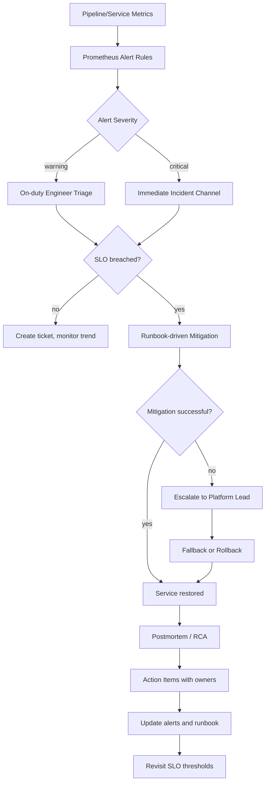

# Incident + SLO + Runbook flow

Диаграмма показывает целевой operational lifecycle: от срабатывания алерта до RCA и обновления runbook/SLO.

## Диаграмма (Mermaid)

## Практический смысл

- Разделяет warning и critical путь эскалации.
- Привязывает инцидент к SLO-контексту, а не только к факту ошибки.
- Закрывает цикл обучения: RCA -> actions -> обновление правил/документации.

## См. также

- [../runbook/AIRFLOW_DAG_TROUBLESHOOTING.md](../runbook/AIRFLOW_DAG_TROUBLESHOOTING.md)
- [../OBSERVABILITY_AND_LOGGING.md](../OBSERVABILITY_AND_LOGGING.md)
- [../GAPS_AND_PRODUCTION_READINESS.md](../GAPS_AND_PRODUCTION_READINESS.md)
