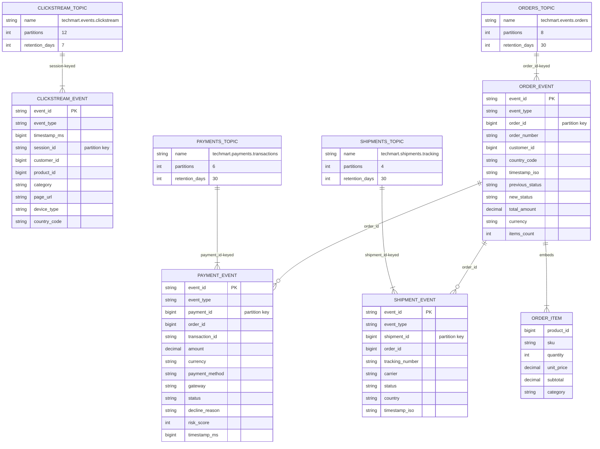

# Kafka Topic Model (Mermaid)

Топики, в которые пишет `data_generator`, и связанные с ними сущности.
Имена и партиционирование задаются через `.env`.

## Соглашения

- Сериализация: JSON (UTF-8) с `linger.ms=50`, `compression.type=lz4`,
  `enable.idempotence=true`.
- Ключи: для clickstream — `session_id`, для остальных топиков — id основной сущности.
- Все события несут `event_id` (UUID-производный) для дедупликации downstream.
- Идемпотентность: события могут повторяться, но `event_id` уникален в пределах потока.

## Связь между топиками

- `ORDER_EVENT.order_id` ↔ `PAYMENT_EVENT.order_id` ↔ `SHIPMENT_EVENT.order_id`.
- `CLICKSTREAM_EVENT.customer_id` ↔ `ORDER_EVENT.customer_id`.
- `ORDER_EVENT.items[*].product_id` ↔ записи в OLTP `products.product_id`.
