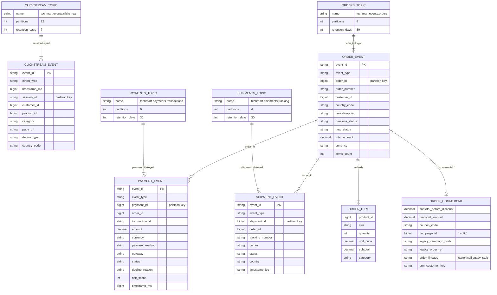

# Kafka: топики и сущности (Mermaid)

## Границы

Логика **топиков и сущностей**, не маршруты ingress. REST Schema Registry и CDC — опциональный overlay; карта контейнеров: [c4-container.md](c4-container.md), [../ARCHITECTURE_CDC.md](../ARCHITECTURE_CDC.md).

**Зачем:** увидеть, какие **потоки событий** питают ingestion, и как сущности связаны на уровне **логики** (не низкоуровневого протокола).

**Генератор** пишет в топики; имена по умолчанию заданы в [configs/generators/company.generator.json](../../configs/generators/company.generator.json) и подхватываются в [generators/common/config.py](../../generators/common/config.py). Переменные окружения (`KAFKA_TOPIC_*`, `KAFKA_BOOTSTRAP_SERVERS`) перекрывают JSON при необходимости.

**См. также:** [../Generators.md](../Generators.md), [../PIPELINES.md](../PIPELINES.md) (ingestion DAG).

## Соглашения

- Сериализация: JSON (UTF-8) с `linger.ms=50`, `compression.type=lz4`; продюсер включает **`enable.idempotence=false`** (устойчивость длинных прогонов в Docker — см. [`kafka_producer.py`](../../generators/infrastructure/connectors/kafka_producer.py)).
- Ключи: для clickstream — `session_id`, для остальных топиков — id основной сущности.
- Все события несут `event_id` (UUID-производный) для дедупликации downstream.
- Идемпотентность: события могут повторяться, но `event_id` уникален в пределах потока.

## Связь между топиками

- `ORDER_EVENT.order_id` ↔ `PAYMENT_EVENT.order_id` ↔ `SHIPMENT_EVENT.order_id`.
- `CLICKSTREAM_EVENT.customer_id` ↔ `ORDER_EVENT.customer_id`.
- `ORDER_EVENT.items[*].product_id` ↔ записи в OLTP `products.product_id`.
- Объект **`commercial`** (в теле `ORDER_EVENT`) совпадает по смыслу с OLTP-колонками заказа (`subtotal`, скидки, линия `legacy_*`) — см. [`02c_oltp_retail_legacy.sql`](../../services/postgres/init/02c_oltp_retail_legacy.sql).

## Расширенные топики (генератор)

На блок-схеме выше они не показаны отдельными «топик-сущностями» — ниже имена по умолчанию из [.env.example](../../.env.example) / [generators/common/config.py](../../generators/common/config.py). События несут FK-подобные ключи (кампании в email-, SEO-, HR-событиях); стыковка с DWH через те же id, что попадают в OLTP после ingestion.

| Топик (default) | Назначение |
|-----------------|------------|
| `techmart.marketing.email_events` | События email вокруг кампаний (JSON) |
| `techmart.seo.organic_sessions` | Органические сессии по поиску (JSON) |
| `techmart.hr.time_tracking` | Учёт времени (clock in/out) |
| `techmart.features.evaluated` | Оценка feature flags по пользователю |

## См. также

- [c4-container.md](c4-container.md) — брокер `kafka` и опциональный CDC
- [oltp-er.md](oltp-er.md), [dwh-schemas.md](dwh-schemas.md)