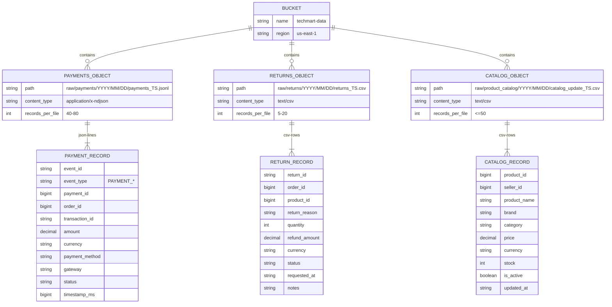

# MinIO: структура объектов (Mermaid)

**Зачем:** понять, как **файловый сырой слой** устроен в bucket (S3-совместимый API), до того как Airflow/Spark заберут данные в БД.

**Bucket** `MINIO_BUCKET_RAW` (часто `techmart-data`) и **префиксы** по умолчанию — в [configs/generators/company.generator.json](../../configs/generators/company.generator.json) и в [generators/common/config.py](../../generators/common/config.py); env (`MINIO_*`, `GENERATOR_MINIO_BATCH_TICKS`) может перекрыть профиль. Периодическая выгрузка зависит от `minio_batch_ticks` в JSON/env и от логики [generators/generator.py](../../generators/generator.py).

**См. также:** [../Generators.md](../Generators.md).

## Расширенные префиксы (генератор)

Дополнительно к базовым префиксам (см. конфиг `MINIO_PREFIX_*`):

| Префикс | Формат | Содержание |
|---------|--------|------------|
| `raw/marketing/campaign_performance` | `YYYY/MM/DD/*.parquet` | Метрики производительности кампаний |
| `raw/seo/rankings` | `YYYY/MM/*.csv` | Позиции ключевых слов по дням |
| `raw/telemetry/performance` | `YYYY/MM/DD/*.parquet` | Web Vitals |
| `raw/telemetry/errors` | `YYYY/MM/DD/*.jsonl` | Ошибки клиента |
| `raw/hr/performance` | `YYYY/Q{n}/*.csv` | Квартальные ревью |

## Партиционирование

- Префиксы: `raw/payments`, `raw/returns`, `raw/product_catalog`.
- Файлы партиционируются по дате (UTC) `YYYY/MM/DD`.
- Имена файлов содержат timestamp `YYYYMMDD_HHMMSS` для идемпотентности.

## Связь с другими источниками

- `payment_id` и `order_id` совпадают с записями из OLTP (`orders.order_id`)
  и Kafka-топиком `${KAFKA_TOPIC_PAYMENTS}`.
- `product_id` ссылается на `products.product_id` (OLTP).
- Файлы caталога — снимки изменений по части `products`.
- Экспорты **marketing / SEO / HR / telemetry** (см. таблицу расширенных префиксов) обычно содержат `campaign_id`, `keyword_id`, `employee_id` — те же бизнес-ключи, что в OLTP после [`02b`](../../services/postgres/init/02b_oltp_marketing_hr_finance.sql) / [`02c`](../../services/postgres/init/02c_oltp_retail_legacy.sql); при «легаси»-источнике часть полей может быть только строковой — тогда сверка в DWH идёт по правилам согласования, а не по строгому FK.
