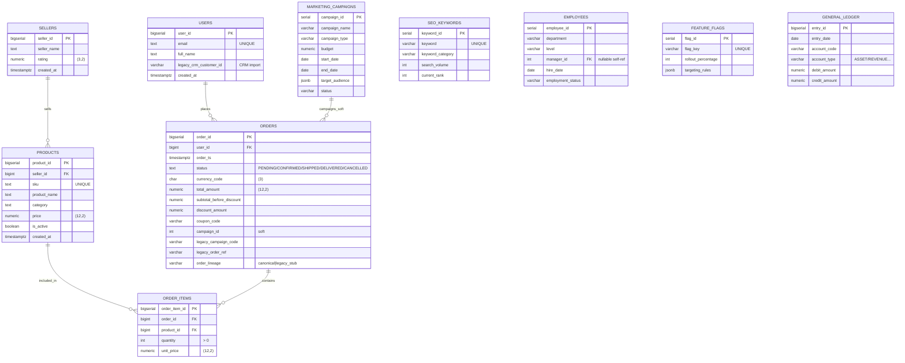

# OLTP: ER-диаграмма (PostgreSQL, Mermaid)

**Зачем:** быстро понять сущности маркетплейса TechMart в транзакционной БД.

**Источник правды по DDL:** [02_oltp_schema.sql](../../services/postgres/init/02_oltp_schema.sql), [02b_oltp_marketing_hr_finance.sql](../../services/postgres/init/02b_oltp_marketing_hr_finance.sql), [02c_oltp_retail_legacy.sql](../../services/postgres/init/02c_oltp_retail_legacy.sql) (ретейл-линия: купоны, софт-кампании, легаси-ключи; контейнер `postgres_oltp` и авто-DDL генератора).

**Генератор:** вставки согласованы с [generators/generator.py](../../generators/generator.py) и [../Generators.md](../Generators.md).

Связь **`MARKETING_CAMPAIGNS`** с **`ORDERS`** на диаграмме означает логическую атрибуцию по полю `orders.campaign_id` (soft pointer, **без FK в БД** — безопасно для легаси-бэкфиллов). Часть строк имитирует легаси-слой (`order_lineage = legacy_stub`, текстовые коды кампаний без join).

## Логические связи и cardinality

- `users 1 -- 0..N orders`: пользователь может иметь множество заказов.
- `sellers 1 -- 0..N products`: продавец публикует много товаров.
- `orders 1 -- 1..N order_items`: каждый заказ имеет хотя бы одну позицию.
- `products 1 -- 0..N order_items`: товар может попадать в множество позиций заказов.
- Генератор задаёт **~70%** заказов как «канонических» (скидка и `campaign_id` или чистая корзина согласованы) и **~30%** как `legacy_stub` (пустой `campaign_id`, заполненные `legacy_campaign_code` / POS-референсы).

## Источник данных

- Заполнение справочников (`users`, `sellers`, `products`) — на старте генератора (seed).
- Заказы и позиции — каждые `GENERATOR_TICK_SECONDS` секунд, объёмом
  `GENERATOR_ORDERS_PER_TICK_MIN..MAX`.
