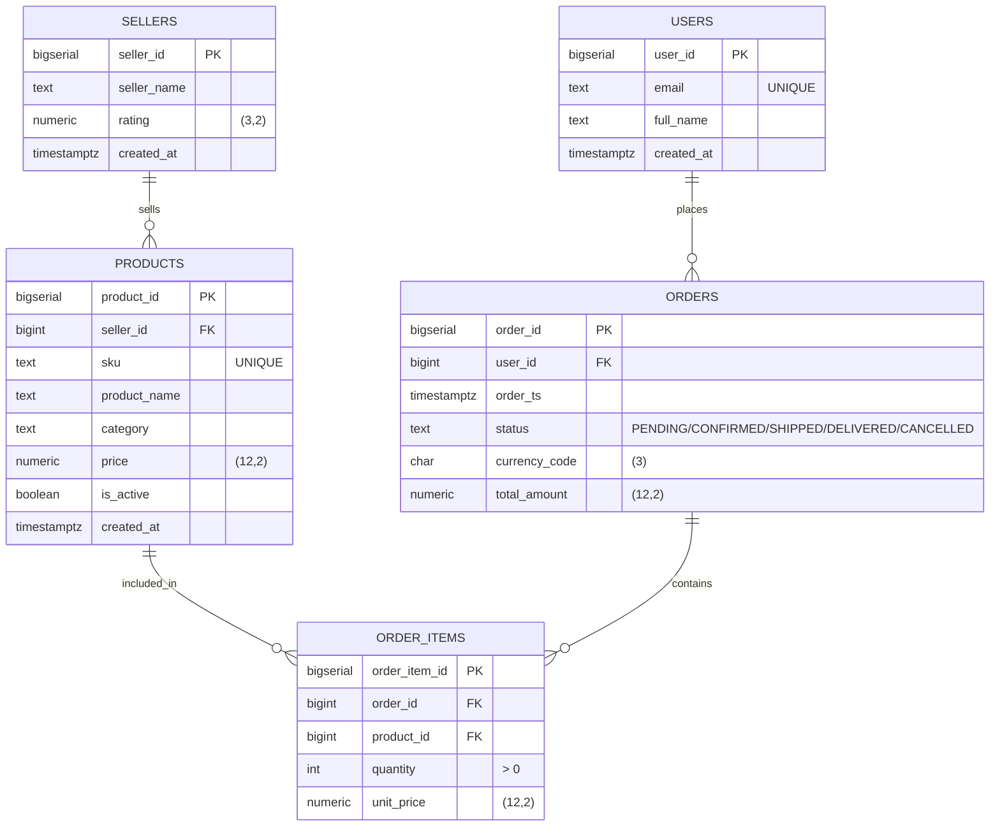

# OLTP ER Diagram (Mermaid)

Source: `services/postgres/init/02_oltp_schema.sql` (фактическая схема контейнера `postgres_oltp`).
Соответствует ему генератор `generators/generator.py`.

## Логические связи и cardinality

- `users 1 -- 0..N orders`: пользователь может иметь множество заказов.
- `sellers 1 -- 0..N products`: продавец публикует много товаров.
- `orders 1 -- 1..N order_items`: каждый заказ имеет хотя бы одну позицию.
- `products 1 -- 0..N order_items`: товар может попадать в множество позиций заказов.

## Источник данных

- Заполнение справочников (`users`, `sellers`, `products`) — на старте генератора (seed).
- Заказы и позиции — каждые `GENERATOR_TICK_SECONDS` секунд, объёмом
  `GENERATOR_ORDERS_PER_TICK_MIN..MAX`.
