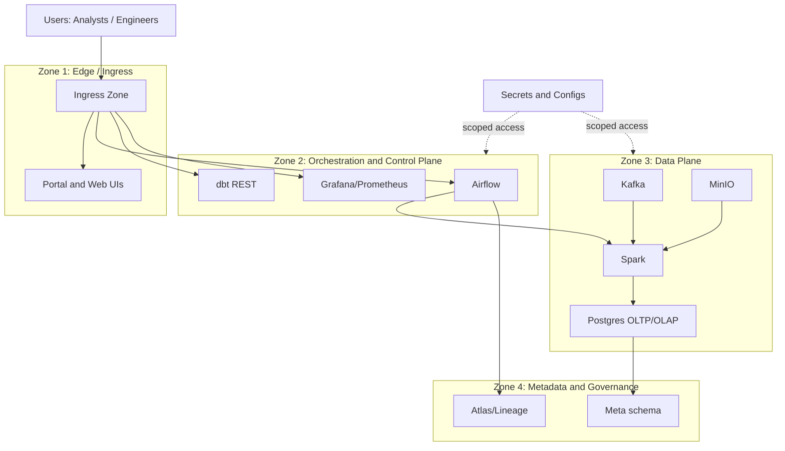

# Security boundaries and trust zones

Диаграмма фиксирует целевую модель зон доверия и каналов доступа для платформы. Это ориентир для hardening, а не утверждение полной реализации.

## Диаграмма (Mermaid)

## Практический смысл

- Отделяет публичный ingress-периметр от внутренних контуров обработки данных.
- Подчёркивает необходимость role-based доступа и scoped secrets по зонам.
- Помогает обсуждать threat model и hardening без привязки к конкретному облаку.

## См. также

- [c4-container.md](c4-container.md)
- [../ARCHITECTURE.md](../ARCHITECTURE.md)
- [../GAPS_AND_PRODUCTION_READINESS.md](../GAPS_AND_PRODUCTION_READINESS.md)
