# Чек-лист диагностики по каждому DAG

Практическое руководство: почему в Airflow «везде разные ошибки», как найти **первопричину**, и что проверять **по каждому DAG**. Источник истины по URI датасетов: [`pipelines/utils/datasets.py`](../../pipelines/utils/datasets.py). Реестр DAG: [`configs/pipeline/dag_registry.yaml`](../../configs/pipeline/dag_registry.yaml). Обзор цепочки: [`PIPELINES.md`](../PIPELINES.md).

Пустые дашборды Superset при отладке витрин OLAP: отдельный сценарий — [`SUPERSET_EMPTY_DASHBOARDS_ELT.md`](SUPERSET_EMPTY_DASHBOARDS_ELT.md) (проверка `dwh_marts` в `postgres_olap`, цепочка DAG, повторный bootstrap).

**Privacy:** после Spark в `staging.stg_customers` нет открытого PII; нужны `SPARK_PRIVACY_SALT` и режим `spark_preprocess_mode` (`all_raw` = AND по четырём raw, `any_raw` = OR). См. также раздел про `dag_spark_preprocess_to_stg` ниже.

**Опциональные Airflow Variables в Jinja:** конструкция `{{ var.value.FOO | default('x') }}` при отсутствии переменной `FOO` всё равно вызывает `Variable.get` и даёт **`KeyError: Variable FOO does not exist`** (фильтр `default` не успевает примениться). Используйте **`{{ var.value.get('FOO', 'x') }}`** (метод `.get` у `VariableAccessor` в Airflow `utils/context.py`).

---

## 1. Самая ранняя failed-задача (не upstream_failed)

Цель: отделить реальный сбой от каскада **skipped / upstream_failed**.

1. Откройте проблемный DAG в Airflow: вкладка **Graph** (или **Grid**) для последнего прогона.
2. Найдите задачу со статусом **failed** (красная). **Не берите** в качестве корня только **upstream_failed** — поднимитесь вверх по графу к ближайшей **failed**.
3. Откройте **Log** этой задачи; зафиксируйте первую строку с исключением / SQL / HTTP / timeout.
4. Если все «красное» — только **upstream_failed**, откройте **родительский** DAG в цепочке dataset (см. раздел ниже) и повторите шаги 1–3.

Порядок обхода цепочки по слоям: **ingestion → Spark preprocess → load_datavault → scd2 → dbt (staging → vault → marts → dqc) → Python DQ → serving**. Обучение ML — отдельная ветка после marts.

---

## 2. Датасеты: что должно обновиться до запуска downstream

До старта dataset-scheduled DAG соответствующий **Dataset** должен быть обновлён успешной задачей с `outlets` (последнее обновление видно в UI или через метаданные прогонов).

| Dataset (логическое имя в реестре) | URI |
|-----------------------------------|-----|
| `raw_oltp` | `postgres://postgres_dwh/raw/oltp` |
| `raw_kafka_orders` | `postgres://postgres_dwh/raw/kafka_orders` |
| `raw_kafka_payments` | `postgres://postgres_dwh/raw/kafka_payments` |
| `raw_minio_files` | `postgres://postgres_dwh/raw/minio_files` |
| `raw_kafka_extensions` | `postgres://postgres_dwh/raw/kafka_extensions` |
| `stg_clean` | `postgres://postgres_dwh/staging/clean` |
| `vault_loaded` | `postgres://postgres_dwh/vault/loaded` |
| `vault_scd2_done` | `postgres://postgres_dwh/vault/scd2` |
| `dbt_staging_done` | `dbt://staging` |
| `dbt_vault_done` | `dbt://vault` |
| `dbt_marts_done` | `dbt://marts` |
| `dbt_dqc_done` | `dbt://dqc` |
| `dq_passed` | `dq://post-marts` |
| `serving_optimized` | `serving://marts-optimized` |
| `ml_train_done` | `ml://spark-training` |

Если downstream «не стартует» без ошибок — проверьте, что upstream run **завершился success** и что триггер действительно **dataset** (не пауза DAG).

---

## 3. Слой ingestion → Spark → Data Vault → SCD2

Без стабильных **четырёх raw** (OLTP, Kafka orders, Kafka payments, MinIO) и успешного **Spark preprocess** дальнейшие vault и dbt обычно не приходят в консистентное состояние. Проверьте по порядку:

| Шаг | Что проверить | Практика |
|-----|----------------|----------|
| Контейнеры | Stack поднят | `docker compose ps` (или эквивалент в вашей среде); unhealthy-сервисы — первый кандидат. |
| Postgres DWH | Доступ из Airflow worker/scheduler | Connection из [`configs/airflow/connections.json`](../../configs/airflow/connections.json) или UI **Admin → Connections**. |
| Kafka | Брокер, топики, consumer group | Логи ingest-DAG; см. конфиги в [`configs/pipeline/`](../../configs/pipeline/). |
| MinIO | Endpoint, bucket, ключи | Переменные окружения ingest; ошибки I/O в логе `dag_ingest_minio_files_to_raw`. |
| Spark | Master UI, сабмит job | Ingress `/spark-master/` ([`WEB_UI_ACCESS.md`](../WEB_UI_ACCESS.md)); логи `dag_spark_preprocess_to_stg`. |
| Vault load / SCD2 | SQL, блокировки, объём данных | Логи `dag_load_datavault`, `dag_scd2_satellites`. |

### Kafka ingest и `ILLEGAL_GENERATION`

Если в логе задачи `consume` у `dag_ingest_kafka_orders_to_raw` / `dag_ingest_kafka_payments_to_raw` / extensions-ingest после успешной вставки в raw падает **`KafkaError{code=ILLEGAL_GENERATION,...}`** на этапе `commit_offsets`, брокер отклонил commit из‑за устаревшего **generation** consumer group (ребаланс, второй consumer с тем же `group.id`, либо слишком долгий интервал без `poll()` между fetch и commit).

**Диагностика consumer group:** префикс задаётся в [`configs/pipeline/ingestion.yaml`](../../configs/pipeline/ingestion.yaml) (`consumer_group_prefix` + ключ топика); в текущей версии кода к имени добавляется **суффикс UUID на каждый вызов** `consume_topic`, точное значение смотрите в логе/metadata прогона (`group_id` в payload старта run). Для старых образов без суффикса группа orders была ровно `dataops-airflow-orders`.

```bash
docker compose exec kafka kafka-consumer-groups --bootstrap-server localhost:9092 --list | grep dataops-airflow
docker compose exec kafka kafka-consumer-groups \
  --bootstrap-server localhost:9092 --describe --group '<имя_из_лога>'
```

Смотрите число **ACTIVE** members, **LAG** и нет ли второго стенда / ручного consumer с тем же `group.id`.

**Источник позиций для следующего прогона** — водяные знаки в Postgres (`meta.pipeline_watermarks`, JSON offsets по pipeline), см. [`services/common/watermarks.py`](../../services/common/watermarks.py) и [`pipelines/dags/ingestion/_kafka_common.py`](../../pipelines/dags/ingestion/_kafka_common.py). Вставка в `raw.*` идёт с `ON CONFLICT ... DO NOTHING` по `(topic, partition_id, kafka_offset)`, поэтому повтор после сбоя commit обычно идемпотентен по строкам.

В репозитории для стабильности: на каждый вызов `consume_topic` задаётся **уникальный** `group.id` (суффикс UUID); водяной знак в Postgres обновляется **до** попытки Kafka-commit; при `ILLEGAL_GENERATION` commit логируется как предупреждение и не валит задачу. Перед commit вызывается **`poll(0)`** — см. [`services/kafka/microbatch_consumer.py`](../../services/kafka/microbatch_consumer.py). Сброс метаданных Airflow или OLAP **не** чистит `__consumer_offsets` на Kafka; при чистке старых групп на брокере ориентируйтесь на политику retention/операционные команды Kafka.

---

## 4. dbt REST и DQC (`dbt test`)

Если падает слой dbt или **`dag_dbt_dqc_rest`**:

1. **Лог задачи** в Airflow: HTTP-код, тело ответа сервиса dbt REST, traceback клиента.
2. Конфиг прогонов: [`configs/pipeline/dbt_rest.yaml`](../../configs/pipeline/dbt_rest.yaml) (в т.ч. `runs.dqc` / селектор тестов).
3. Смысл ошибок `relation does not exist` при **тестах**: чаще всего не полностью собраны модели выше по слою — убедитесь, что **`dag_dbt_marts_rest`** (и при необходимости vault/staging) завершились **success** до DQC.
4. Сервис **dbt_rest** в compose: healthcheck и зависимости `airflow_webserver` (см. [`docker-compose.yml`](../../docker-compose.yml)).

Логи контейнера (пример):

```bash
docker compose logs dbt_rest --tail 200
docker compose logs airflow_scheduler --tail 200
```

---

## Поток данных (dataset-цепочка)

```mermaid
flowchart LR
  subgraph ingest [Ingestion_cron]
    OLT[dag_ingest_oltp_to_stg]
    Ko[dag_ingest_kafka_orders_to_raw]
    Kp[dag_ingest_kafka_payments_to_raw]
    Ke[dag_ingest_kafka_extensions_to_raw]
    Mi[dag_ingest_minio_files_to_raw]
  end
  subgraph spark [Spark]
    Sp[dag_spark_preprocess_to_stg]
  end
  subgraph dv [Data_Vault]
    Ld[dag_load_datavault]
    Sc[dag_scd2_satellites]
  end
  subgraph dbt [dbt_REST]
    St[dag_dbt_staging_rest]
    Va[dag_dbt_vault_rest]
    Ma[dag_dbt_marts_rest]
    Dq[dag_dbt_dqc_rest]
  end
  OLT --> DS_OLTP[DS_RAW_OLTP]
  Ko --> DS_Ko[DS_RAW_KAFKA_ORDERS]
  Kp --> DS_Kp[DS_RAW_KAFKA_PAYMENTS]
  Mi --> DS_Mi[DS_RAW_MINIO_FILES]
  Ke --> DS_Ke[DS_RAW_KAFKA_EXTENSIONS]
  DS_OLTP --> Sp
  DS_Ko --> Sp
  DS_Kp --> Sp
  DS_Mi --> Sp
  Sp --> DS_Stg[DS_STG_CLEAN]
  DS_Stg --> Ld
  Ld --> DS_Vl[DS_VAULT_LOADED]
  DS_Vl --> Sc
  Sc --> DS_S2[DS_VAULT_SCD2_DONE]
  DS_S2 --> St
  DS_S2 --> Va
  DS_Stg --> Va
  St --> DS_Dv[DS_DBT_VAULT_DONE]
  Va --> DS_Dv
  DS_Dv --> Ma
  Ma --> DS_Ma[DS_DBT_MARTS_DONE]
  DS_Ma --> Dq
  Dq --> DS_Dqc[DS_DBT_DQC_DONE]
  DS_Dqc --> PyDQ[dag_data_quality_checks]
  PyDQ --> DS_Dqp[DS_DQ_PASSED]
  DS_Dqp --> Serv[dag_serving_optimizations]
  DS_Ma --> ML[dag_ml_train_spark]
```



---

## Таблица: каждый DAG

### Ingestion (cron → raw, обновление dataset)

| DAG | Триггер | Проверить |
|-----|---------|-----------|
| [`dag_ingest_oltp_to_stg`](../../pipelines/dags/ingestion/ingest_oltp_to_stg.py) | Расписание (см. реестр) | OLTP доступен; креды; задача с `outlets=[DS_RAW_OLTP]`; данные в raw по контракту. |
| [`dag_ingest_kafka_orders_to_raw`](../../pipelines/dags/ingestion/ingest_kafka_orders_to_raw.py) | Cron | Kafka/topic; consumer; запись в Postgres; `DS_RAW_KAFKA_ORDERS`. |
| [`dag_ingest_kafka_payments_to_raw`](../../pipelines/dags/ingestion/ingest_kafka_payments_to_raw.py) | Cron | То же; `DS_RAW_KAFKA_PAYMENTS`. |
| [`dag_ingest_kafka_extensions_to_raw`](../../pipelines/dags/ingestion/ingest_kafka_extensions_to_raw.py) | Cron | Extensions; `DS_RAW_KAFKA_EXTENSIONS`. Влияет на **`dag_dbt_vault_rest`**, если нет триггера от staging. |
| [`dag_ingest_minio_files_to_raw`](../../pipelines/dags/ingestion/ingest_minio_files_to_raw.py) | Cron | MinIO; `DS_RAW_MINIO_FILES`. |

### Transformation (dataset)

| DAG | Зависимости | Проверить |
|-----|-------------|-----------|
| [`dag_spark_preprocess_to_stg`](../../pipelines/dags/transformation/spark_preprocess_to_stg.py) | `DS_RAW_OLTP \| DS_RAW_KAFKA_ORDERS \| DS_RAW_KAFKA_PAYMENTS \| DS_RAW_MINIO_FILES` | Spark; при «тишине» — какие из четырёх raw реально обновляются; `DS_STG_CLEAN`. |
| [`dag_load_datavault`](../../pipelines/dags/transformation/load_datavault.py) | `DS_STG_CLEAN` | Vault SQL; блокировки; `DS_VAULT_LOADED`. |
| [`dag_scd2_satellites`](../../pipelines/dags/transformation/scd2_satellites.py) | `DS_VAULT_LOADED` | SCD2; `DS_VAULT_SCD2_DONE`. |

### dbt через REST

| DAG | Зависимости | Проверить |
|-----|-------------|-----------|
| [`dag_dbt_staging_rest`](../../pipelines/dags/transformation/dbt_staging_rest.py) | `DS_VAULT_SCD2_DONE` | dbt REST; слой staging в `dbt_rest.yaml`; `DS_DBT_STAGING_DONE`. |
| [`dag_dbt_vault_rest`](../../pipelines/dags/transformation/dbt_vault_rest.py) | `DS_DBT_STAGING_DONE \| DS_RAW_KAFKA_EXTENSIONS` | Какой dataset запустил прогон; vault run; `DS_DBT_VAULT_DONE`. |
| [`dag_dbt_marts_rest`](../../pipelines/dags/transformation/dbt_marts_rest.py) | `DS_DBT_VAULT_DONE` | marts build; `DS_DBT_MARTS_DONE`. |
| [`dag_dbt_dqc_rest`](../../pipelines/dags/transformation/dbt_dqc_rest.py) | `DS_DBT_MARTS_DONE` | `dqc` / тесты; модели собраны; `DS_DBT_DQC_DONE`. |

### Quality и serving

| DAG | Зависимости | Проверить |
|-----|-------------|-----------|
| [`dag_data_quality_checks`](../../pipelines/dags/quality/data_quality_checks.py) | `DS_DBT_DQC_DONE` | Python DQ; доступ к DWH; `DS_DQ_PASSED`. |
| [`dag_serving_optimizations`](../../pipelines/dags/maintenance/serving_optimizations.py) | `DS_DQ_PASSED` | Код DAG (индексы/VACUUM и т.д.); `DS_SERVING_OPTIMIZED`. |

### ML

| DAG | Зависимости | Проверить |
|-----|-------------|-----------|
| [`dag_ml_train_spark`](../../pipelines/dags/ml/dag_ml_train_spark.py) | `DS_DBT_MARTS_DONE` (без DQC) | Spark, артефакты обучения; ошибки ML не обязаны совпадать с цепочкой DQ. |

### Integration

| DAG | Триггер | Проверить |
|-----|---------|-----------|
| [`atlas_cdc_integration_touchpoint`](../../pipelines/dags/integration/atlas_cdc_touchpoint.py) | Ручной (`schedule=None`) | `ATLAS_REST_URL`, `DEBEZIUM_CONNECT_HEALTH_URL`; сетевой доступ. |
| [`atlas_metadata_sync`](../../pipelines/dags/integration/atlas_metadata_sync.py) | `0 */6 * * *` | Atlas API; креды; соответствие схемы DWH. |

---

## Общий чек-лист для любого инцидента

| Шаг | Действие |
|-----|----------|
| 1 | Graph → первая **failed** (не только upstream_failed). |
| 2 | Log задачи → первичная ошибка. |
| 3 | Для dataset DAG — обновлялся ли нужный URI (таблица выше). |
| 4 | Connections / env: Postgres, Kafka, MinIO, Spark, dbt REST. |
| 5 | `docker compose ps` и точечные `docker logs` для сервиса из ошибки. |

---

## Снимок последних прогонов через API

Скрипт (с хоста или CI): [`scripts/airflow_last_runs.py`](../../scripts/airflow_last_runs.py).

Переменные окружения по умолчанию согласованы с [`../.env.example`](../../.env.example):

- `AIRFLOW_API_BASE_URL` — например `http://localhost:8080/airflow/api/v1` (или через ingress: `http://localhost:8090/airflow/api/v1`).
- `AIRFLOW_ADMIN_USER` / `AIRFLOW_ADMIN_PASSWORD` — учётка с доступом к REST API.

Пример:

```bash
cd DataOpsShowcase
export AIRFLOW_API_BASE_URL=http://localhost:8080/airflow/api/v1
export AIRFLOW_ADMIN_USER=admin
export AIRFLOW_ADMIN_PASSWORD=admin
python scripts/airflow_last_runs.py
python scripts/airflow_last_runs.py --json
```
